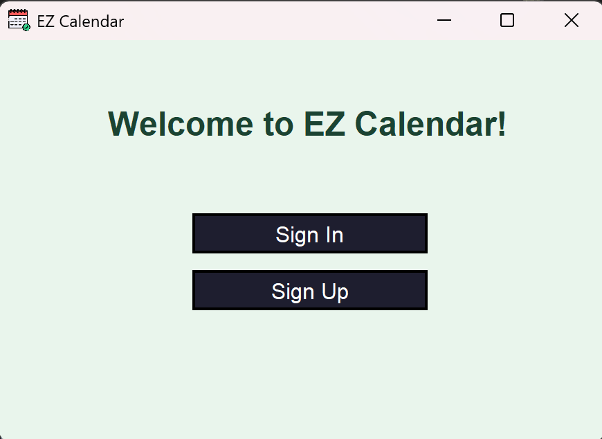
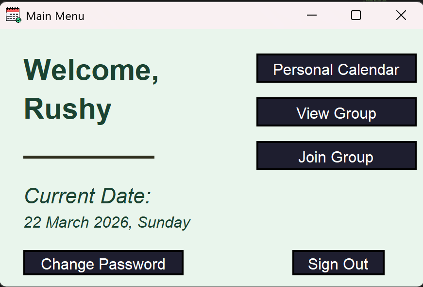
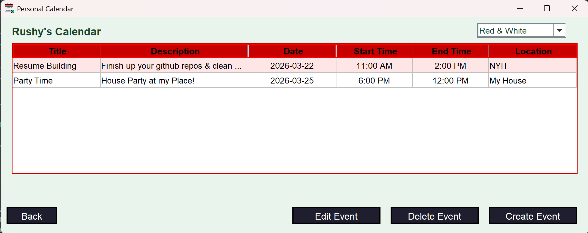
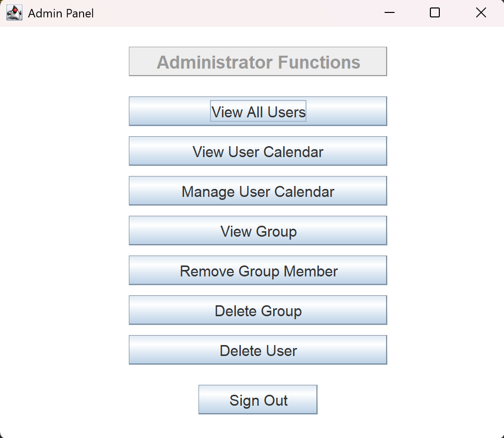
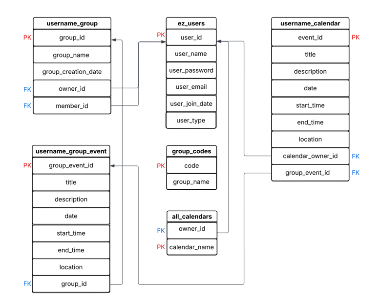

# EzCalendar

A **team-based Java + SQL calendar management application** designed to simplify personal scheduling and group event coordination. The system allows users to manage personal events, create and join groups, and share events through a group-oriented calendar workflow backed by a MySQL database.

## Overview

EzCalendar combines personal calendar management, group planning, and administrative controls into one desktop application. The project demonstrates Java GUI development, JDBC-based database integration, relational database design, and multi-user workflow support within a shared scheduling system.

## My Role in the Team Project

For this **four-person group project**, I contributed to:
- Admin-side functionality for deleting users
- Removing events from user calendars
- Managing and deleting groups within the system
- User interface work for the core program and admin features
- Presentation materials, diagrams, and the final project report

## Features

- User sign-up and sign-in
- Personal calendar management
- Group creation and group joining
- Group event creation and event viewing
- Admin controls for managing users, groups, and calendar data

## Tech Stack

- Java
- MySQL
- SQL
- JDBC
- IntelliJ IDEA / VS Code
- External library dependencies in `lib/`

## Project Structure

- `src/` — Java source code
- `resources/` — project resources
- `lib/` — required dependency jars
- `sql/` — database schema and setup scripts

## Screenshots

### Sign Up / Sign In

### Main Menu

### Personal Calendar

### Admin Panel

## Database Design

The application is backed by a relational schema designed to support user accounts, personal events, group workflows, and administrative controls.

## Database Setup

1. Make sure MySQL Server is installed and running.
2. Open MySQL Workbench or another MySQL client.
3. Run the SQL setup file `Ez_CalendarSQL.sql` in the `sql/` folder to create the database and required tables.
4. Confirm that the database name is:
   - `ez_calendar`

## Database Configuration

This project connects to a local MySQL instance. Public repository credentials are not included.

Update the database username and password in the database connection class before running locally.

Use placeholders in the public repo:
- DB user: `YOUR_DB_USER`
- DB password: `YOUR_DB_PASSWORD`

The project uses a JDBC connection similar to:
- `jdbc:mysql://localhost:3306/ez_calendar?useSSL=false&allowPublicKeyRetrieval=true&serverTimezone=UTC`

## Dependencies

Required dependency jars are included in the `lib/` folder.

This project uses external libraries for:
- MySQL JDBC connectivity
- table and result-set handling
- password-related utilities

## How to Run

1. Clone the repository.
2. Open the project in IntelliJ IDEA or VS Code with Java support.
3. Ensure MySQL Server is running.
4. Run the SQL setup script `Ez_CalendarSQL.sql` in the `sql/` folder.
5. Update the database credentials locally in the database connection class.
6. Run the application from:
   - `Ez_Calendar_Window` (contains `public static void main`)

## Why This Project Matters

This project highlights:
- Java desktop application development
- relational database design for multi-user workflows
- JDBC integration with MySQL
- personal and group scheduling logic
- admin-side data management features
- teamwork within a larger software project

It also demonstrates how a shared calendar system can support both individual scheduling and group coordination within the same application.

## Notes

- Completed as a **four-person group project**
- The contribution section above highlights my individual work
- The repository includes local dependency jars in `lib/` for easier setup
- Real database credentials should not be committed to the public repository

## Future Improvements

- Add recurring event support
- Improve UI consistency and polish
- Expand group permissions and role handling
- Add reminders or notifications
- Improve validation and error handling across workflows

## Summary

EzCalendar is a team-based calendar application that combines personal scheduling, shared group planning, and administrative controls into one Java + SQL desktop system.
